# The Redemption Service — Infrastructure

> **Accor Cloud Engineer Assessment** — AWS EKS production architecture for the hotel loyalty-point deduction microservice.  
> Region: `ap-southeast-1` (Singapore) · Zero downtime · Auto-scales 10× on Flash Sales

---

## Architecture Overview

```mermaid
flowchart TD
    subgraph USERS["👥 Users / Clients"]
        A1["📱 Mobile App\nHotel Guests"]
        A2["💻 Web App\nFront Desk"]
        A3["🔗 API Consumers\n3rd-Party Partners"]
    end

    subgraph EDGE["🌐 Edge Layer  (AWS)"]
        B1["CloudFront\nGlobal CDN · DDoS Protection"]
        B2["AWS WAF v2\nOWASP Rules · Rate Limiting"]
        B3["Route 53\nDNS · Health Routing"]
    end

    subgraph VPC["🔷 VPC  10.0.0.0/16  —  ap-southeast-1"]

        subgraph PUBLIC["🟢 Public Subnets ×3 AZs  —  NAT Gateways + ALB only"]
            C1["Application Load Balancer\nHTTPS 443 · ACM TLS · WAFv2\n60s deregistration · Access logs → S3"]
            C2["NAT GW AZ-a"] 
            C3["NAT GW AZ-b"]
            C4["NAT GW AZ-c"]
        end

        subgraph PRIVATE["🔵 Private Subnets ×3 AZs  —  EKS Worker Nodes"]
            D0["EKS Control Plane v1.29\nAWS Managed · Private endpoint\nAudit logs → CloudWatch"]

            subgraph BASELINE["On-Demand Nodes  m6i.xlarge ×3–6  (Baseline)"]
                E1["redemption pod\nAZ-a"]
                E2["redemption pod\nAZ-b"]
                E3["redemption pod\nAZ-c"]
            end

            subgraph BURST["⚡ Spot Nodes  m6i/m6a/m5.xlarge ×0–30  (Flash Sale Burst)"]
                F1["redemption pod\nburst"]
                F2["redemption pod\nburst"]
                F3["... up to 47 pods"]
            end

            G1["HPA: 3→50 replicas\nCPU >60% · RPS >500\nScale-up: instant · Scale-down: 5 min"]
            G2["KEDA: SQS queue depth\n1 pod per 10 messages\nPre-empts CPU lag"]
            G3["Cluster Autoscaler (IRSA)\nPending pods → add Spot nodes ~90s\nNode Termination Handler: 2-min drain"]
            G4["PodDisruptionBudget\nminAvailable: 70%\nToplogySpread: maxSkew 1 per AZ+Node"]
            G5["kube-system: CoreDNS · VPC CNI · AWS LB Controller\nKEDA · Cluster Autoscaler · External Secrets · Fluent Bit"]
        end

        subgraph DATA["🔴 Data Subnets ×3 AZs  —  Stateful Services (ports 5432/6379 only from Private)"]
            H1["Aurora PostgreSQL\nMulti-AZ · KMS encrypted\n1 writer + 2 read replicas\nAuto-failover ~30s"]
            H2["ElastiCache Redis\nCluster mode · Multi-AZ\nSession cache · Rate limiter\nTTL 5 min"]
            H3["SQS Queue\nredemption-jobs\nKEDA trigger · DLQ"]
        end
    end

    subgraph AWS_SVC["☁️ AWS Managed Services"]
        S1["Secrets Manager\nDB creds · auto-rotation"]
        S2["ECR Private\nImage scanning · immutable tags"]
        S3["CloudWatch + Alarms\nLogs 90-day · PagerDuty"]
        S4["Managed Prometheus\nSLO metrics · recording rules"]
        S5["Managed Grafana\nDashboards · alerts"]
        S6["X-Ray\nDistributed tracing"]
        S7["KMS\nEKS secrets · EBS · Aurora · S3"]
        S8["ACM\nTLS certs · auto-renewal"]
        S9["VPC Flow Logs\nAll traffic · 90-day"]
        S10["ArgoCD GitOps\nGit push → deploy"]
    end

    %% ── Traffic flow ──
    A1 & A2 & A3 -->|HTTPS| B1
    B1 --> B2 --> B3
    B3 -->|DNS resolve| C1
    C1 -->|HTTP internal| E1 & E2 & E3
    C1 -->|HTTP burst| F1 & F2

    %% ── Pods → data ──
    E1 & F1 -->|SQL :5432| H1
    E2 & F2 -->|Redis :6379| H2
    E3 & F3 -->|SQS consume| H3

    %% ── Scaling ──
    G1 -.->|scale| BASELINE
    G2 -.->|scale| BASELINE
    G3 -.->|add nodes| BURST
    G4 -.->|protect| BASELINE

    %% ── Pods → AWS services ──
    E1 -.->|IRSA| S1
    E2 -.->|metrics| S3
    E2 -.->|metrics| S4
    E3 -.->|traces| S6

    %% ── Egress ──
    PRIVATE -->|outbound via| C2 & C3 & C4
```



---

## SLO Targets

| SLI | Target | Alert |
|-----|--------|-------|
| Availability | 99.9% (≤ 0.1% errors) | Error rate > 1% for 5 min → page |
| Latency p99 | < 2 s | > 2 s for 5 min → warn |
| Latency p50 | < 300 ms | Dashboard only |
| Scale-out | 3 → 50 pods in < 3 min | HPA maxed → warn |

---

## Security at a Glance

| Layer | Control |
|-------|---------|
| Network | Default-deny NetworkPolicy; ALB→pods only on :8080; pods→DB/Redis/SQS only |
| Identity | IRSA (least-privilege): pods read own Secrets Manager path, own SQS queue, own CloudWatch namespace |
| Node | IMDSv2 enforced (hop-limit 1), read-only root FS, non-root UID, all Linux capabilities dropped |
| Encryption | KMS: EKS secrets, EBS, Aurora, S3, CloudWatch Logs |
| Access | Private EKS endpoint; no SSH — SSM Session Manager only |

---

## Prerequisites

| Tool | Version |
|------|---------|
| Terraform | >= 1.6.0 |
| kubectl | >= 1.29 |
| AWS CLI | >= 2.15 |
| helm | >= 3.14 |

---

## Quick Start

### 1. Bootstrap remote state

```bash
aws s3 mb s3://accor-tf-state-prod --region ap-southeast-1
aws dynamodb create-table \
  --table-name accor-tf-locks \
  --attribute-definitions AttributeName=LockID,AttributeType=S \
  --key-schema AttributeName=LockID,KeyType=HASH \
  --billing-mode PAY_PER_REQUEST \
  --region ap-southeast-1
```

### 2. Deploy infrastructure

```bash
cd terraform/envs/production
terraform init
terraform plan -out=tfplan
terraform apply tfplan
```

### 3. Configure kubectl

```bash
aws eks update-kubeconfig \
  --name redemption-production \
  --region ap-southeast-1
```

### 4. Install cluster add-ons (Helm)

```bash
# AWS Load Balancer Controller
helm repo add eks https://aws.github.io/eks-charts
helm install aws-load-balancer-controller eks/aws-load-balancer-controller \
  -n kube-system --set clusterName=redemption-production

# Cluster Autoscaler
helm repo add autoscaler https://kubernetes.github.io/autoscaler
helm install cluster-autoscaler autoscaler/cluster-autoscaler \
  -n kube-system \
  --set autoDiscovery.clusterName=redemption-production \
  --set awsRegion=ap-southeast-1

# KEDA
helm repo add kedacore https://kedacore.github.io/charts
helm install keda kedacore/keda -n kube-system

# External Secrets Operator
helm repo add external-secrets https://charts.external-secrets.io
helm install external-secrets external-secrets/external-secrets -n kube-system

# Prometheus stack
helm repo add prometheus-community https://prometheus-community.github.io/helm-charts
helm install prometheus prometheus-community/kube-prometheus-stack \
  -n monitoring --create-namespace
```

### 5. Deploy the application

Replace `ACCOUNT_ID` and `IMAGE_TAG` in `k8s/base/deployment.yaml`, then:

```bash
kubectl apply -f k8s/base/
kubectl apply -f k8s/autoscaling/
kubectl apply -f k8s/monitoring/
```

### 6. Verify

```bash
kubectl get pods -n redemption
kubectl get hpa -n redemption
kubectl get ingress -n redemption
```

---

## Flash Sale Pre-warm

For scheduled Flash Sales, pre-scale before the event to bypass the ~90 s autoscaler cold start:

```bash
kubectl scale deployment/redemption -n redemption --replicas=20
kubectl get nodes -w   # watch Cluster Autoscaler add burst nodes
```

---

## Repository Structure

```
accor-redemption/
├── terraform/
│   ├── modules/
│   │   ├── vpc/               VPC, subnets ×3 AZs, NAT GWs, Flow Logs
│   │   ├── eks/               Cluster, baseline + burst node groups, KMS, add-ons
│   │   ├── iam/               Cluster/node roles, IRSA (app + autoscaler)
│   │   └── security-groups/   Cluster ↔ node SGs
│   └── envs/production/       main.tf · variables.tf · outputs.tf
├── k8s/
│   ├── base/                  Namespace, Deployment, Service, Ingress
│   │   ├── namespace.yaml     Pod Security Standards: restricted
│   │   ├── deployment.yaml    Topology spread, rolling update, security context
│   │   ├── pdb.yaml           minAvailable 70%
│   │   ├── ingress.yaml       ALB + WAFv2 + ACM
│   │   ├── configmap.yaml     App tuning (circuit breaker, pool sizes)
│   │   └── network-policy.yaml  Default-deny + explicit allow rules
│   ├── autoscaling/
│   │   ├── hpa.yaml           CPU/memory/RPS triggers (3–50 replicas)
│   │   └── keda-scaledobject.yaml  SQS queue-depth trigger
│   └── monitoring/
│       └── servicemonitor-alerts.yaml  PrometheusRules + ServiceMonitor
└── docs/
    ├── architecture-diagram.drawio    Open in app.diagrams.net
    └── design-document.md             Full architectural decision record
```

---

## Design Document

See [docs/design-document.md](docs/design-document.md) for the complete architectural decisions, trade-offs, failure scenarios, SLO targets, and team delegation plan (1 Senior + 2 Juniors over 3 sprints).

## Architecture Diagram

A standalone diagram with component summary and network security layers is at [docs/architecture-diagram.md](docs/architecture-diagram.md).
