# Architecture Diagram — The Redemption Service

AWS EKS production architecture, ap-southeast-1 (Singapore)

---

## High-Level Data Flow

```mermaid
flowchart TD
    subgraph USERS["👥 Users / Clients"]
        A1["📱 Mobile App\nHotel Guests"]
        A2["💻 Web App\nFront Desk"]
        A3["🔗 API Consumers\n3rd-Party Partners"]
    end

    subgraph EDGE["🌐 Edge Layer"]
        B1["CloudFront\nGlobal CDN · DDoS Protection"]
        B2["AWS WAF v2\nOWASP Rules · Rate Limiting"]
        B3["Route 53\nDNS · Health Routing"]
    end

    subgraph VPC["🔷 VPC  10.0.0.0/16  —  ap-southeast-1"]

        subgraph PUBLIC["🟢 Public Subnets ×3 AZs — NAT Gateways + ALB only"]
            C1["Application Load Balancer\nHTTPS 443 · ACM TLS · WAFv2\n60s deregistration · Access logs → S3"]
            C2["NAT GW\nAZ-a"]
            C3["NAT GW\nAZ-b"]
            C4["NAT GW\nAZ-c"]
        end

        subgraph PRIVATE["🔵 Private Subnets ×3 AZs — EKS Worker Nodes"]
            D0["EKS Control Plane v1.29\nAWS Managed · Private endpoint\nAudit logs → CloudWatch"]

            subgraph BASELINE["🟦 On-Demand Nodes  m6i.xlarge ×3–6  (Steady State)"]
                E1["redemption pod · AZ-a"]
                E2["redemption pod · AZ-b"]
                E3["redemption pod · AZ-c"]
            end

            subgraph BURST["🟠 Spot Nodes  m6i/m6a/m5.xlarge ×0–30  (Flash Sale Burst)"]
                F1["redemption pod · burst"]
                F2["redemption pod · burst"]
                F3["... up to 47 pods total"]
            end

            G1["HPA\n3 → 50 replicas\nCPU >60% · RPS >500\nScale-up: instant · Scale-down: 5 min cooldown"]
            G2["KEDA\nSQS queue depth trigger\n1 pod per 10 messages"]
            G3["Cluster Autoscaler\nPending pods → add Spot nodes ~90s\nNode Termination Handler: 2-min drain"]
            G4["PodDisruptionBudget\nminAvailable: 70%\nTopologySpread: maxSkew 1 per AZ + Node\nRollingUpdate: maxUnavailable 0"]
        end

        subgraph DATA["🔴 Data Subnets ×3 AZs — Stateful Services"]
            H1["Aurora PostgreSQL\nMulti-AZ · KMS encrypted\n1 writer + 2 read replicas\nAuto-failover ~30s"]
            H2["ElastiCache Redis\nCluster mode · Multi-AZ\nSession cache · Rate limiter\nTTL 5 min"]
            H3["SQS Queue\nredemption-jobs\nKEDA trigger source · DLQ"]
        end
    end

    subgraph AWS_SVC["☁️ AWS Managed Services"]
        S1["Secrets Manager\nDB creds · auto-rotation (IRSA)"]
        S2["ECR Private\nImage scanning · immutable tags"]
        S3["CloudWatch\nLogs 90-day · Alarms · PagerDuty"]
        S4["Managed Prometheus\nSLO metrics · recording rules"]
        S5["Managed Grafana\nDashboards · alerting"]
        S6["AWS X-Ray\nDistributed tracing"]
        S7["KMS\nEKS secrets · EBS · Aurora · S3 · CW Logs"]
        S8["ACM\nTLS certificates · auto-renewal"]
        S9["ArgoCD (GitOps)\nGit push → zero-touch deploy"]
    end

    %% Traffic flow
    A1 & A2 & A3 -->|HTTPS| B1
    B1 --> B2 --> B3
    B3 -->|DNS resolve| C1
    C1 -->|HTTP — TLS terminated| E1 & E2 & E3
    C1 -->|HTTP — burst traffic| F1 & F2

    %% Pods → data tier
    E1 & F1 -->|SQL :5432| H1
    E2 & F2 -->|Redis :6379| H2
    E3 & F3 -->|SQS consume| H3

    %% Autoscaling
    G1 -.->|scale pods| BASELINE
    G2 -.->|scale pods| BASELINE
    G3 -.->|add nodes| BURST
    G4 -.->|protect availability| BASELINE

    %% Pods → AWS services
    E1 -.->|IRSA auth| S1
    E2 -.->|metrics| S3 & S4
    E3 -.->|traces| S6

    %% Outbound
    PRIVATE -->|outbound via| C2 & C3 & C4
```



---

## Component Summary

| Component | Purpose | Key Config |
|-----------|---------|-----------|
| **CloudFront + WAF** | Edge protection, DDoS mitigation | OWASP managed rule set, rate limiting |
| **ALB** | TLS termination, load distribution | ACM cert, 60s deregistration delay |
| **EKS (private)** | Container orchestration | v1.29, private endpoint, KMS secrets encryption |
| **Baseline nodes** | Steady-state compute (On-Demand) | m6i.xlarge ×3–6, one per AZ |
| **Burst nodes** | Flash Sale overflow (Spot) | m6i/m6a/m5.xlarge ×0–30, 60% cheaper |
| **HPA** | CPU/memory/RPS-based pod scaling | 3→50 replicas, instant scale-up |
| **KEDA** | Queue-depth event-driven scaling | 1 pod per 10 SQS messages |
| **Cluster Autoscaler** | Node-level scaling | ~90s scale-out, 10min scale-in |
| **PDB** | Availability floor | minAvailable 70% |
| **Aurora PostgreSQL** | Primary datastore | Multi-AZ, auto-failover ~30s |
| **ElastiCache Redis** | Caching + rate limiting | Cluster mode, Multi-AZ |
| **SQS** | Async job queue | DLQ, KEDA trigger |
| **Secrets Manager** | Credentials at rest | IRSA, auto-rotation |
| **KMS** | Encryption everywhere | EKS, EBS, Aurora, S3, CW Logs |

---

## Network Security Layers

```
Internet
  │  HTTPS 443 only
  ▼
CloudFront + WAF (OWASP rules, rate limiting)
  │
  ▼
ALB — Public Subnet (TLS terminated, WAFv2 associated)
  │  HTTP — private network only
  ▼
EKS Pods — Private Subnet (no public IPs on nodes)
  │  Kubernetes NetworkPolicy: default-deny → explicit allow only
  │    pods → Aurora  :5432
  │    pods → Redis   :6379
  │    pods → SQS/AWS :443
  │    pods → DNS     :53
  ▼
Aurora / Redis / SQS — Data Subnet (SG allows only private subnet CIDRs)
```
